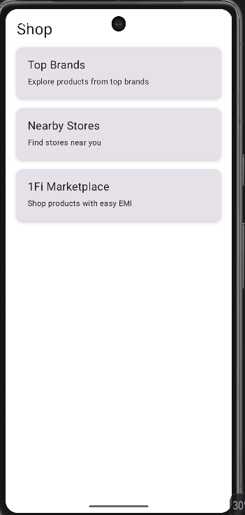
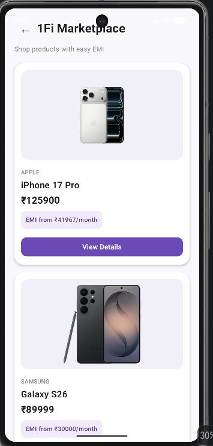
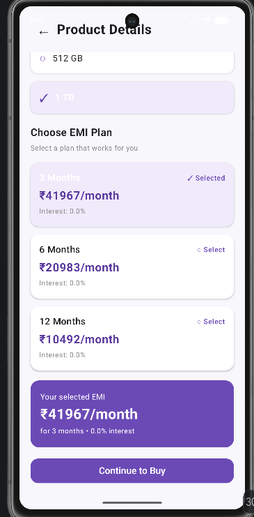
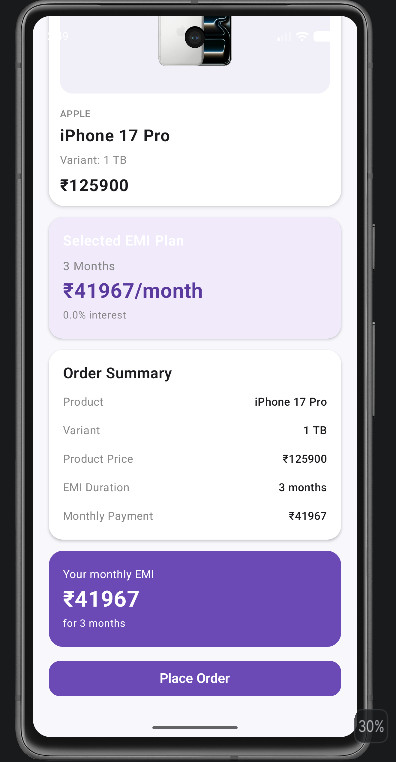
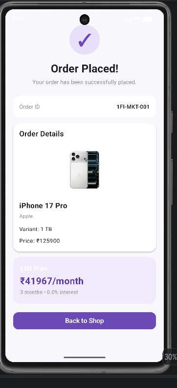

# 1Fi Marketplace

A mobile marketplace experience built as part of the 1Fi SDE Intern Android Assignment.

The feature integrates a product shopping flow with EMI options, allowing users to browse products, view product details, select variants and EMI plans, review their order, and place an order.

---

## Features

### Shop

The Shop screen includes:

- Top Brands
- Nearby Stores
- 1Fi Marketplace

Top Brands and Nearby Stores are kept as placeholders as they are outside the implementation scope of this assignment.

### 1Fi Marketplace

The Marketplace includes:

- Product listing
- Product images
- Brand and product name
- Product pricing
- Available variants
- EMI information
- Product details
- EMI plan selection
- Continue to Buy CTA

### Checkout

The checkout flow includes:

- Selected product details
- Selected variant
- Selected EMI plan
- Product price
- EMI duration
- Monthly payment
- Order summary
- Place Order CTA

### Order Confirmation

After placing an order, the user sees:

- Order confirmation
- Order ID
- Product details
- Selected variant
- Product price
- Selected EMI plan
- Monthly EMI amount
- Back to Shop option

---

## User Flow

```text
Shop
  ↓
1Fi Marketplace
  ↓
Product Listing
  ↓
View Details
  ↓
Product Details
  ↓
Select Variant
  ↓
Select EMI Plan
  ↓
Continue to Buy
  ↓
Checkout
  ↓
Place Order
  ↓
Order Confirmation
  ↓
Back to Shop

---










### Order Confirmation


